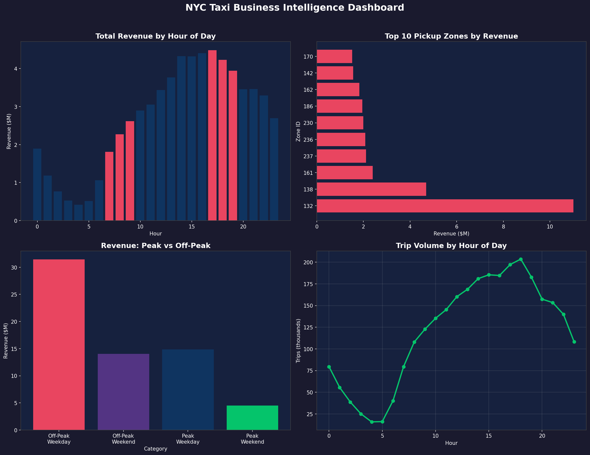

# NYC Taxi Business Intelligence Pipeline  
**End-to-end BI solution processing 3M+ NYC Yellow Taxi trips (Jan 2023)**

  
*Interactive Power BI dashboard connected to Snowflake via DirectQuery*

### Project Overview
This project demonstrates a complete, production-grade Business Intelligence pipeline using the modern data stack that leading analytics teams use in 2025–2026.

From raw Parquet ingestion → distributed ETL & advanced Spark SQL analytics → cloud data warehouse modeling in Snowflake → live executive dashboard in Power BI.

It showcases:
- Scalable big data processing (3M+ records)
- Advanced SQL analytics (CTEs, window functions, ranking, Z-score anomaly detection)
- Cloud warehouse integration (Snowflake)
- Business-focused visualization & insight generation

### Key Business Insights Delivered
- **Total revenue (Jan 2023)**: $64.81M across 2.88M clean trips
- **Highest revenue hour**: 17:00 – $4.48M (evening rush hour peak)
- **Top revenue zone**: Zone 132 (JFK Airport) – $11.01M (17% of total)
- **Busiest corridor**: Zone 237 → 236 (Midtown Manhattan) – 21,361 trips
- **Credit card dominance**: 84% of revenue ($54.67M) with $4.17 average tip
- **Off-Peak Weekday share**: 48.5% of total revenue ($31.44M) – highest single segment
- **Evening peak demand**: ~20% higher trip volume in high-traffic zones
- **Anomaly detection**: Fare outliers flagged using Z-score > 3

### Architecture
Raw Parquet (3M+ records)
↓
PySpark ETL + Feature Engineering (10 derived columns)
↓
Spark SQL Analytics (8 dimensions: hourly KPIs, zone ranking, corridors, anomalies, etc.)
↓
CSV Exports (5 summary tables)
↓
Snowflake (4 production tables + DirectQuery)
↓
Power BI Dashboard (geospatial, time-series, KPIs, peak/off-peak comparison)


### Tech Stack
- **Distributed Processing**: PySpark 4.0, Apache Spark
- **Analytics Engine**: Spark SQL (CTEs, Window Functions, Z-Score, Ranking)
- **Cloud Data Warehouse**: Snowflake (trial) – 4 tables, DirectQuery
- **Visualization**: Power BI (DAX, geospatial maps, slicers, drill-down)
- **Data Manipulation**: Python (Pandas, PyArrow)
- **Version Control**: GitHub

### Repository Structure

### Repository Structure

```text
nyc-taxi-business-intelligence-pipeline/
├── nyc_taxi_pipeline.ipynb              # Full PySpark ETL + Spark SQL + Snowflake integration pipeline
├── analytics.sql                        # Standalone advanced Snowflake queries (CTEs, window functions, ranking, etc.)
├── dashboard_preview.png                # Power BI dashboard screenshot (multi-panel view)
├── summary_hourly_kpis.csv              # Hourly KPIs: trips, revenue, avg fare by pickup hour
├── summary_zone_kpis.csv                # Zone-level KPIs: top revenue zones, trips, avg fare/mile
├── summary_peak_offpeak.csv             # Peak vs Off-Peak × Weekday/Weekend breakdown
├── summary_payment_analysis.csv         # Revenue & tipping behavior by payment type
├── summary_top_corridors.csv            # Top pickup → dropoff routes & corridors
└── README.md                            # This documentation file
```

### How to Reproduce
1. **Prerequisites**
   ```bash
   pip install pyspark snowflake-connector-python pandas pyarrow findspark
2. **Download Dataset**
   curl -O https://d37ci6vzurychx.cloudfront.net/trip-data/yellow_tripdata_2023-01.parquet
3. **Snowflake Setup** (free trial – https://signup.snowflake.com)
- Create database & schema: NYC_TAXI_DB / TAXI_ANALYTICS
- Create 4 tables (see analytics.sql for DDL)
- Load CSVs via Snowsight UI or COPY INTO
4. **Run the Notebook**
- Open nyc_taxi_pipeline.ipynb
- Set Snowflake credentials as environment variables
- Run cells top to bottom
5. **Build Dashboard**
- Connect Power BI to Snowflake via DirectQuery
- Recreate visuals using the exported CSVs as reference

### Business Recommendations
- **Maximize evening rush (17:00–20:00):** Deploy highest driver capacity — highest revenue window.
- **Prioritize JFK Airport (Zone 132):** Long-haul, high-fare trips generate outsized returns.
- **Promote credit card payments:** 84% revenue + 4× higher tipping behavior.
- **Target off-peak weekday volume:** Largest single revenue segment — focus on retention & incentives.

### Author
#### Abhinaya Ragipani
- MS Data Sciences & Applications – University at Buffalo, SUNY (GPA: 3.93)
- **Dataset Source:** NYC Taxi & Limousine Commission – Yellow Taxi Trip Records (Jan 2023)
